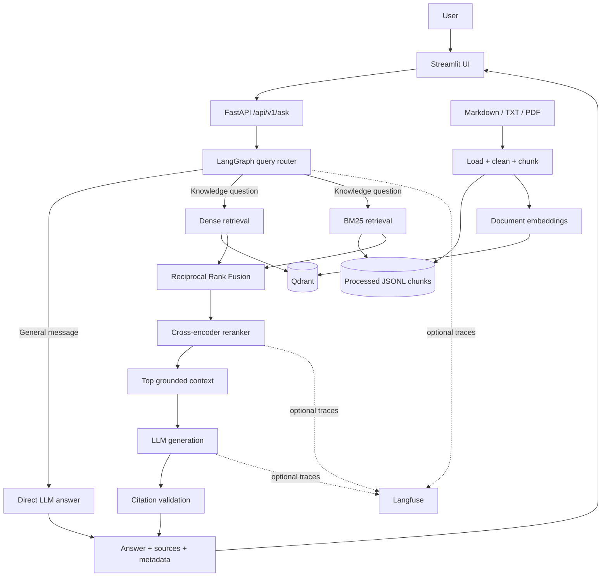

# OpsRAG

[](https://github.com/miracozmen23/opsrag/actions/workflows/tests.yml)

A compact, production-oriented technical knowledge assistant with hybrid retrieval,
cross-encoder reranking, verified source citations, offline evaluation, optional
observability, and a polished web interface.

> **Status:** Milestone 17 · Python 3.11+ · 176 automated tests · Dockerized local stack

## Why OpsRAG?

Technical teams often have the answer to an incident somewhere in a runbook,
deployment guide, or troubleshooting note, but finding the right passage quickly
is difficult. OpsRAG turns a small private document collection into a searchable
assistant that:

- retrieves evidence before answering technical questions;
- exposes the source records used by the answer;
- rejects missing, malformed, or invented citations;
- distinguishes knowledge-base questions from clearly general messages; and
- measures retrieval and answer quality instead of relying on a demo alone.

The project is intentionally compact. Its purpose is to demonstrate practical RAG
engineering—from ingestion through evaluation and delivery—without hiding the
important decisions inside a notebook or adding unrelated distributed systems.

## Product walkthrough

### Landing experience


*Responsive landing page with example incident prompts and a concise view of
the answer pipeline.*

### Grounded answer


*A real Docker Compose troubleshooting question routed through hybrid retrieval
and returned with two citations, five contexts, and retrieval metadata.*

### Source evidence


*Expanded evidence cards expose retrieval-owned document, section, chunk, and
relevance details for every cited source.*

## Key features

- Markdown, TXT, and text-based PDF ingestion with deterministic cleaning
- Section-aware 600-token chunks with stable identifiers and overlap
- Sentence Transformers embeddings stored in Qdrant
- BM25 lexical retrieval for commands, error codes, and exact technical terms
- Reciprocal Rank Fusion across dense and sparse rankings
- Cross-encoder reranking before final context construction
- Grounded answers with request-local source identifiers such as `[S1]`
- Citation validation and API-owned source metadata
- Bounded LangGraph routing with knowledge and general branches
- OpenAI Responses API and free local Ollama generation adapters
- FastAPI backend and responsive Streamlit product interface
- RAGAS evaluation across dense, hybrid, and reranked configurations
- Optional, fail-open Langfuse traces with explicit privacy guidance
- CPU-only, non-root Docker images and health-gated Docker Compose services
- 176 offline unit and integration tests
- GitHub Actions tests on every push and pull request targeting `main`

## Architecture



Knowledge requests follow a single bounded path:

```text
Dense Qdrant search + BM25
        -> RRF fusion
        -> cross-encoder reranking
        -> grounded prompt
        -> LLM
        -> citation validation
        -> public API response
```

Clearly general messages bypass retrieval. Ambiguous or technical questions
default to the knowledge path, which is the safer behavior for a private
technical assistant.

See [the architecture guide](docs/architecture.md) for detailed module
boundaries, confidence semantics, trace structure, and data flow.

## Technology stack

| Area | Technology | Purpose |
| --- | --- | --- |
| Language | Python 3.11+ | Application, ingestion, evaluation, and tests |
| API | FastAPI + Uvicorn | Validated HTTP boundary and runtime |
| Workflow | LangGraph | Bounded query classification and routing |
| Vector database | Qdrant | Dense vector storage and similarity search |
| Dense retrieval | Sentence Transformers | Document and query embeddings |
| Sparse retrieval | rank-bm25 | Exact-term lexical retrieval |
| Fusion | Reciprocal Rank Fusion | Rank-scale-independent hybrid retrieval |
| Reranking | CrossEncoder | Query-aware final context selection |
| LLM providers | Ollama / OpenAI | Local-free or hosted answer generation |
| Evaluation | RAGAS | Faithfulness, relevance, precision, and recall |
| Observability | Langfuse | Optional nested request traces |
| Frontend | Streamlit | Product-style browser interface |
| Validation | Pydantic Settings | Typed configuration and API contracts |
| Tests | Pytest + HTTPX | Unit, integration, HTTP, and UI checks |
| Delivery | Docker Compose | Qdrant, API, and frontend local stack |
| CI | GitHub Actions | Automatic offline tests on pushes and PRs |

## Quick start with Docker

### Prerequisites

- Docker Desktop with Compose
- Ollama for the free local profile, or an OpenAI API key
- Git

Clone and configure the project:

```bash
git clone https://github.com/miracozmen23/opsrag.git
cd opsrag
cp .env.example .env
```

On Windows PowerShell, use `Copy-Item .env.example .env` instead of `cp`.

For the free local profile, set these values in `.env`:

```env
LLM_PROVIDER=ollama
LLM_MODEL=qwen3.5:2b
OLLAMA_BASE_URL=http://localhost:11434
```

Pull the local model and start the stack:

```bash
ollama pull qwen3.5:2b
docker compose up --build -d
```

Ingest the sample knowledge base and build the Qdrant index:

```bash
docker compose run --rm api python scripts/ingest.py
docker compose run --rm api python scripts/index.py
```

Open the services:

- Streamlit: <http://localhost:8501>
- FastAPI documentation: <http://localhost:8000/docs>
- Health check: <http://localhost:8000/health>
- Qdrant dashboard: <http://localhost:6333/dashboard>

Check health and logs:

```bash
docker compose ps
docker compose logs -f api frontend
```

Stop containers without deleting the bind-mounted project data:

```bash
docker compose down
```

Compose publishes ports only on localhost. It reaches host Ollama through
`host.docker.internal`. On native Linux, Ollama may also need
`OLLAMA_HOST=0.0.0.0:11434`.

Model files, processed documents, and Qdrant data remain on the repository drive
through `.cache`, `data`, and `qdrant_storage` bind mounts. These growing
artifacts are excluded from Git.

## Local development

Create and activate a virtual environment:

```bash
python -m venv .venv
```

```powershell
# Windows PowerShell
.\.venv\Scripts\Activate.ps1
```

```bash
# macOS / Linux
source .venv/bin/activate
```

Install CPU-only PyTorch and the project dependencies:

```bash
python -m pip install --upgrade pip
python -m pip install --index-url https://download.pytorch.org/whl/cpu "torch>=2.2,<3.0"
python -m pip install -e ".[dev]"
cp .env.example .env
```

Start only Qdrant with Docker:

```bash
docker compose up -d qdrant
```

Build the index, start the API, and then start Streamlit in a second terminal:

```bash
python scripts/ingest.py
python scripts/index.py
python -m uvicorn app.main:app --reload
```

```bash
python -m streamlit run frontend/streamlit_app.py
```

The first model-backed command downloads embedding and reranker files to
`MODEL_CACHE_DIR`, which defaults to the repository-local
`.cache/huggingface` directory.

## Environment variables

Copy [`.env.example`](.env.example) to `.env`. Never commit the resulting
file or any real credentials.

### Application and ingestion

| Variable | Default | Purpose |
| --- | --- | --- |
| `APP_ENV` | `development` | Runtime environment label |
| `LOG_LEVEL` | `INFO` | Application logging level |
| `CHUNK_SIZE_TOKENS` | `600` | Maximum deterministic chunk size |
| `CHUNK_OVERLAP_TOKENS` | `75` | Token overlap between adjacent chunks |
| `TOKENIZER_STRATEGY` | `regex_v1` | Stable tokenizer strategy |
| `PROCESSED_CHUNKS_PATH` | `data/processed/chunks.jsonl` | Generated chunk artifact |
| `MODEL_CACHE_DIR` | `.cache/huggingface` | Local model cache |

### Retrieval

| Variable | Default | Purpose |
| --- | --- | --- |
| `EMBEDDING_MODEL` | `BAAI/bge-small-en-v1.5` | Dense embedding model |
| `EMBEDDING_DEVICE` | `cpu` | Embedding execution device |
| `EMBEDDING_BATCH_SIZE` | `32` | Embedding batch size |
| `RERANKER_MODEL` | `cross-encoder/ms-marco-MiniLM-L6-v2` | Cross-encoder model |
| `RERANKER_DEVICE` | `cpu` | Reranker execution device |
| `RERANKER_BATCH_SIZE` | `16` | Reranker batch size |
| `QDRANT_URL` | `http://localhost:6333` | Qdrant endpoint |
| `QDRANT_API_KEY` | empty | Optional Qdrant credential |
| `QDRANT_COLLECTION` | `opsrag_documents` | Vector collection |
| `QDRANT_TIMEOUT_SECONDS` | `10` | Qdrant request timeout |
| `QDRANT_BATCH_SIZE` | `64` | Indexing upsert batch size |
| `TOP_K_DENSE` | `10` | Dense candidates |
| `TOP_K_SPARSE` | `10` | BM25 candidates |
| `TOP_K_HYBRID` | `10` | Reranker candidate pool |
| `TOP_K_RERANK` | `5` | Final prompt contexts |
| `RRF_K` | `60` | Reciprocal Rank Fusion constant |

### Generation and evaluation

| Variable | Default | Purpose |
| --- | --- | --- |
| `LLM_PROVIDER` | `openai` | `openai` or `ollama` |
| `LLM_MODEL` | empty | Provider model name |
| `LLM_API_KEY` | empty | Required only for OpenAI |
| `LLM_TIMEOUT_SECONDS` | `30` | Answer request timeout |
| `LLM_MAX_OUTPUT_TOKENS` | `800` | Answer output limit |
| `OLLAMA_BASE_URL` | `http://localhost:11434` | Local Ollama endpoint |
| `RAGAS_JUDGE_PROVIDER` | empty | Optional `openai` or `ollama` judge |
| `RAGAS_JUDGE_MODEL` | empty | Judge model name |
| `RAGAS_CACHE_DIR` | `.cache/ragas` | Evaluation model cache |
| `RAGAS_TIMEOUT_SECONDS` | `60` | Per-metric timeout |
| `RAGAS_MAX_RETRIES` | `3` | Metric retry count |
| `RAGAS_MAX_OUTPUT_TOKENS` | `512` | Judge output limit |

### Observability and frontend

| Variable | Default | Purpose |
| --- | --- | --- |
| `LANGFUSE_ENABLED` | `false` | Explicit tracing opt-in |
| `LANGFUSE_PUBLIC_KEY` | empty | Langfuse project key |
| `LANGFUSE_SECRET_KEY` | empty | Langfuse secret |
| `LANGFUSE_BASE_URL` | `https://cloud.langfuse.com` | Approved trace destination |
| `LANGFUSE_SAMPLE_RATE` | `1.0` | Fraction of requests traced |
| `OPSRAG_API_BASE_URL` | `http://localhost:8000` | Streamlit backend |
| `OPSRAG_API_TIMEOUT_SECONDS` | `300` | UI request timeout |

Relative data and cache paths resolve from the repository root, not from the
terminal's current directory.

## Ingestion and indexing

The sample corpus lives in `data/raw`. Add Markdown, TXT, or text-based PDF
files there, then run:

```bash
python scripts/ingest.py
python scripts/index.py
```

Ingestion loads and cleans supported documents, preserves title/section/page
metadata, creates deterministic chunks, and writes
`data/processed/chunks.jsonl`. Indexing embeds those chunks and replaces only
points belonging to the indexed document IDs.

Collection recreation is never implicit. Use this only when an incompatible
embedding dimension or intentional reset requires it:

```bash
python scripts/index.py --recreate
```

Useful retrieval checks:

```bash
python scripts/search.py "PostgreSQL connection refused"
python scripts/sparse_search.py "pg_hba.conf authentication"
python scripts/hybrid_search.py "HTTP 503 Qdrant"
python scripts/rerank_search.py "When should an API return 4xx instead of 5xx?"
```

## Using the application

### Streamlit

Open <http://localhost:8501>, choose an example or enter a question, and select
**Generate grounded answer**. The interface displays:

- the validated answer;
- retrieval confidence;
- selected route and retrieval method;
- retrieved context count; and
- expandable source evidence with relevance indicators.

If the API is stopped, times out, or violates the response contract, Streamlit
shows a safe error rather than an application traceback.

### API

Health check:

```bash
curl http://localhost:8000/health
```

Knowledge question:

```bash
curl -X POST http://localhost:8000/api/v1/ask \
  -H "Content-Type: application/json" \
  -d '{"question":"Why does PostgreSQL return connection refused in Docker Compose?"}'
```

Example response:

```json
{
  "answer": "Inside the application container, use the PostgreSQL Compose service name and container port [S1].",
  "sources": [
    {
      "source_id": "S1",
      "document": "postgresql_troubleshooting.md",
      "title": "PostgreSQL Troubleshooting",
      "section": "Connection refused",
      "page_number": null,
      "score": 0.9491,
      "chunk_id": "chunk_...",
      "chunk_ids": ["chunk_..."]
    }
  ],
  "retrieval_confidence": 0.9491,
  "metadata": {
    "retrieved_chunks": 5,
    "cited_sources": 1,
    "retrieval_method": "hybrid_reranked",
    "route": "knowledge"
  }
}
```

General messages return `route="general"`, `retrieval_method="not_used"`,
no sources, and zero retrieval confidence.

## Source grounding and confidence

Before generation, retrieved chunks are grouped by original source, title,
section, and page. Each group receives a request-local identifier such as
`S1`. The prompt contains only those identifiers and retrieval-owned metadata.

After generation, OpsRAG:

1. rejects answers without a citation when context was used;
2. rejects malformed or unknown source identifiers;
3. removes repeated citations; and
4. returns only the source records cited by the answer.

The model cannot invent a document filename that appears in the API response.
Public source metadata always comes from the retrieved chunk payload.

For reranked results, the public relevance score is the sigmoid of the
cross-encoder logit. `retrieval_confidence` is the best relevance score among
the sources actually cited. It is a retrieval heuristic, not a calibrated
probability and not an LLM self-assessment.

## Evaluation

The version-controlled benchmark in
[`evaluation/questions.jsonl`](evaluation/questions.jsonl) contains 36
manually reviewable cases:

- 30 answerable cases grounded in the five sample documents;
- 6 insufficient-context cases;
- 6 cases in each of semantic, exact-keyword, error-code, multi-sentence,
  ambiguous, and insufficient-context categories.

Validate the benchmark without calling a model:

```bash
python scripts/validate_evaluation.py
```

Install the optional RAGAS evaluation stack before the first scored run:

```bash
python -m pip install -e ".[evaluation]"
```

Run dense, hybrid, and hybrid-plus-reranking experiments:

```bash
python scripts/evaluate.py
```

The runner captures generated answers, retrieved contexts, citations, latency,
expected-source hits, answerability, and RAGAS faithfulness, answer relevance,
context precision, and context recall. Failures and undefined metrics remain
visible and are excluded from means; they are never silently converted to zero.

Runs involving OpenAI require `--confirm-paid-run`. The checked-in baseline
used Ollama for both answering and judging and made no paid API calls.

### Verified local baseline

Generated on 2026-08-27 with 108 executions (36 cases × 3 retrieval
configurations), Ollama `qwen3.5:2b`, RAGAS 0.4.3, and
`BAAI/bge-small-en-v1.5` embeddings:

| Configuration | App failures | Expected-source hit | Answerability | Answer relevance | Context precision | Context recall | Mean latency |
| --- | ---: | ---: | ---: | ---: | ---: | ---: | ---: |
| Dense | 3/36 | 93.33% | 88.89% | 0.7424 | 0.8215 | 0.8177 | 6.56 s |
| Hybrid | 3/36 | 90.00% | 88.89% | 0.7285 | 0.7841 | 0.7903 | 6.32 s |
| Hybrid + reranking | 3/36 | 86.67% | **91.67%** | **0.7452** | 0.7747 | 0.7833 | 10.58 s |

These results are a transparent local baseline, not a claim that reranking wins
every metric. The small judge produced incomplete faithfulness outputs:
faithfulness was scored for only 11 dense, 13 hybrid, and 11 reranked cases.
Those coverage failures remain in
[`evaluation/results.json`](evaluation/results.json).

See [the evaluation guide](evaluation/README.md) for schemas, per-metric scored
counts, review instructions, and result provenance.

## Tests and CI

Run the complete offline suite:

```bash
python -m pytest
```


*The complete local suite passes 176 unit and integration tests.*

The 176 tests cover:

- cleaning, loading, deterministic chunking, and JSONL output;
- Qdrant storage, indexing, and dense retrieval;
- BM25, RRF, deduplication, and reranking;
- prompt formatting, source grouping, and citation validation;
- router and RAG pipeline behavior;
- OpenAI, Ollama, configuration, and observability boundaries;
- FastAPI contracts and a real HTTP client/server boundary;
- Streamlit interactions; and
- an in-memory Qdrant-to-FastAPI end-to-end retrieval path.

Embeddings, reranking, and generation use deterministic substitutes in the
deepest integration test. Storage, indexing, dense search, BM25, RRF,
orchestration, grounding, LangGraph, and FastAPI serialization remain real.
No test needs an API key, internet connection, model download, or paid request.

Warnings fail the suite. GitHub Actions runs the same command with Python 3.11
and CPU-only PyTorch on every push and pull request targeting `main`.

Current and historical runs are available on the
[GitHub Actions workflow page](https://github.com/miracozmen23/opsrag/actions/workflows/tests.yml).

## Optional Langfuse observability

Tracing is disabled by default. Enable it only when the configured Langfuse host
is approved to receive questions and retrieved knowledge-base excerpts:

```env
LANGFUSE_ENABLED=true
LANGFUSE_PUBLIC_KEY=<public key>
LANGFUSE_SECRET_KEY=<secret key>
LANGFUSE_BASE_URL=https://cloud.langfuse.com
LANGFUSE_SAMPLE_RATE=1.0
```

A knowledge request produces:

```text
opsrag.query
|-- query.classify
`-- rag.pipeline
    |-- rag.retrieve
    |-- rag.generate
    `-- rag.attribution
```

Missing credentials, an unavailable SDK, initialization errors, or exporter
failures fall back safely without breaking the answer request.

A Langfuse screenshot is intentionally omitted from the default README because
tracing is opt-in and no synthetic trace is presented as a production record.

## Repository structure

```text
opsrag/
|-- .github/workflows/tests.yml   # Push and pull-request CI
|-- app/
|   |-- api/                      # FastAPI routes, schemas, dependencies
|   |-- core/                     # Settings, factories, logging
|   |-- embeddings/               # Sentence Transformer adapter
|   |-- evaluation/               # Dataset, runner, RAGAS, results
|   |-- ingestion/                # Load, clean, chunk, index
|   |-- llm/                      # Provider-neutral LLM adapters
|   |-- observability/            # No-op and Langfuse tracing
|   |-- rag/                      # Graph, prompts, attribution, pipeline
|   `-- retrieval/                # Dense, BM25, RRF, reranking
|-- data/raw/                     # Sample technical knowledge base
|-- docs/                         # Architecture and README images
|-- evaluation/                   # Benchmark, results, evaluation guide
|-- frontend/                     # Streamlit UI, theme, API client
|-- scripts/                      # Ingest, index, search, evaluate CLIs
|-- tests/unit/                   # Focused deterministic tests
|-- tests/integration/            # API, HTTP, Streamlit, full RAG path
|-- .env.example                  # Safe configuration template
|-- docker-compose.yml            # Qdrant, API, frontend topology
|-- Dockerfile                    # Shared CPU-only application image
|-- pyproject.toml                # Package and test configuration
`-- README.md
```

Generated chunks, model caches, local secrets, and Qdrant storage are excluded
from Git.

## Engineering decisions

| Decision | Reason | Trade-off |
| --- | --- | --- |
| Conservative rule-based router | Technical questions default to grounded retrieval | General-language coverage is intentionally narrow |
| Separate dense and BM25 retrieval | Semantic and exact technical matches need different signals | Two indexes must stay aligned |
| RRF instead of raw-score mixing | Cosine and BM25 scores are not directly comparable | Rank information is used instead of calibrated fusion |
| Cross-encoder after fusion | Expensive scoring is limited to a small candidate pool | Adds latency to knowledge requests |
| Retrieval-owned citations | Prevents the model from inventing public source metadata | Invalid model output is rejected rather than repaired silently |
| Lazy knowledge pipeline | General messages do not load models or contact Qdrant | First technical request carries setup latency |
| Project-local caches and bind mounts | Large artifacts stay on the repository drive | Local disk management remains the operator's responsibility |
| Optional fail-open tracing | Observability cannot break user requests | Export failures may require log inspection |
| Offline deterministic tests | CI is free, repeatable, and secretless | Model quality is measured separately by the benchmark |
| Honest metric failures | Undefined/failed RAGAS outcomes are not reported as zero | Aggregate tables need scored-count context |

## Limitations

- The bundled corpus contains five small operational documents; it is not a
  large-scale knowledge platform.
- The router is deliberately rule-based and recognizes a bounded set of clearly
  general messages.
- BM25 is rebuilt in memory from the processed JSONL artifact.
- API requests are synchronous and responses are not streamed.
- PDF ingestion supports text-based files; scanned PDFs require OCR outside the
  current scope.
- There is no authentication, authorization, tenant isolation, rate limiting,
  or cloud deployment configuration.
- Qdrant runs as a single local service; high availability and distributed
  operations are out of scope.
- The free `qwen3.5:2b` evaluator produced incomplete faithfulness judgments,
  so the baseline is useful for comparison but not a gold-standard quality
  claim.
- `retrieval_confidence` is a relevance heuristic rather than a calibrated
  probability.

## Future improvements

- Expand the corpus and create a larger human-reviewed evaluation set.
- Repeat evaluation with a stronger judge and compare confidence intervals.
- Add metadata filtering and persistent sparse indexing for larger collections.
- Add token streaming and asynchronous model calls.
- Add authentication, rate limiting, and per-tenant collections before
  exposing the service beyond localhost.
- Add OCR for scanned documents and richer ingestion formats.
- Calibrate retrieval confidence against labeled relevance judgments.
- Add deployment profiles only when a real target environment is selected.

## Further documentation

- [Architecture](docs/architecture.md)
- [Evaluation methodology and schemas](evaluation/README.md)
- [Step-by-step project specification](OPSRAG_PROJECT_PLAN.md)
