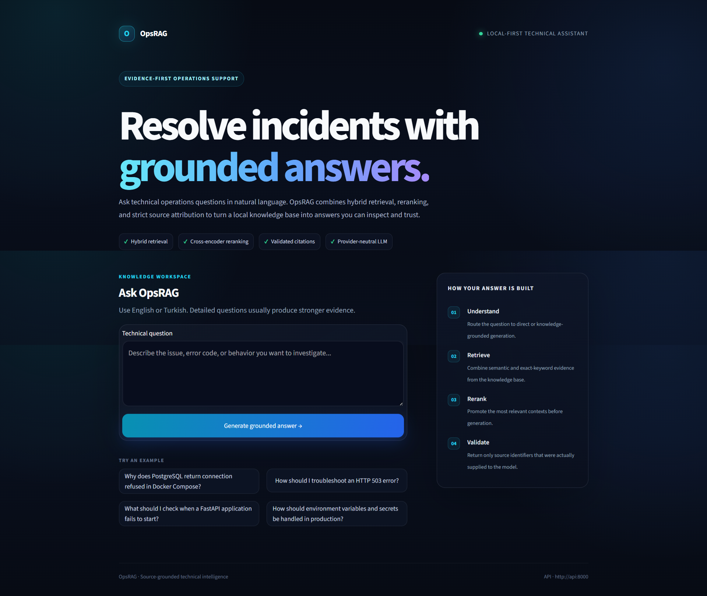
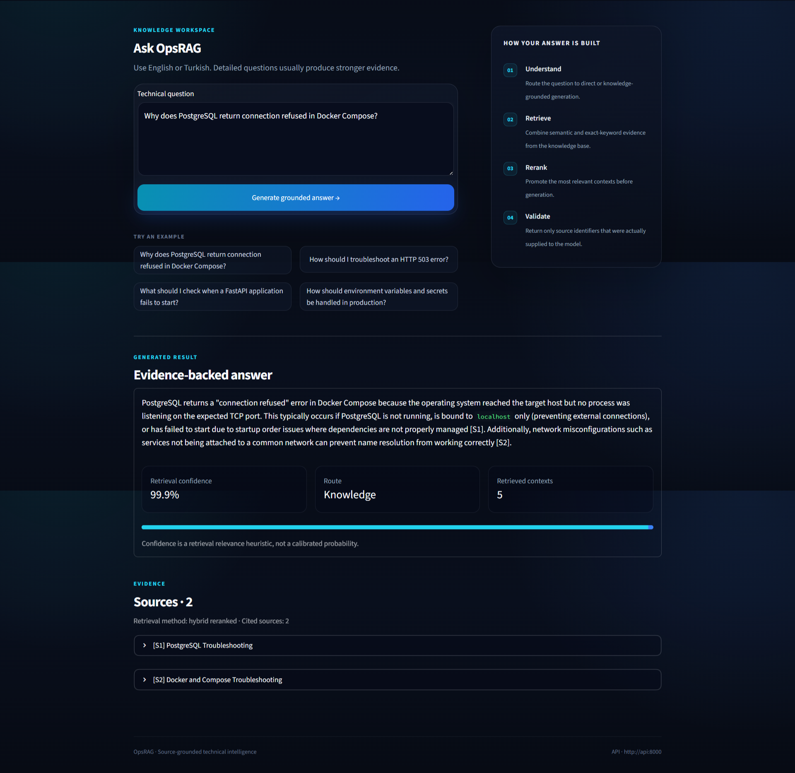
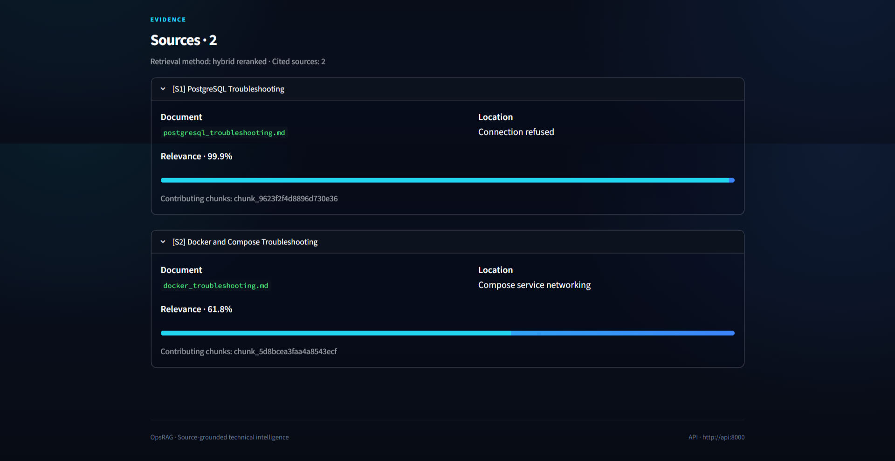
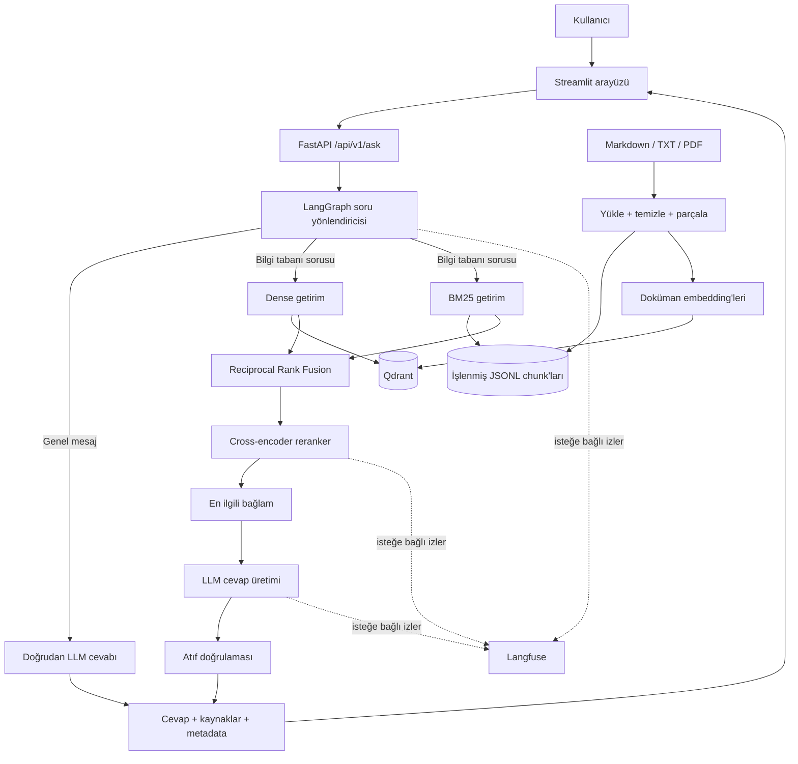
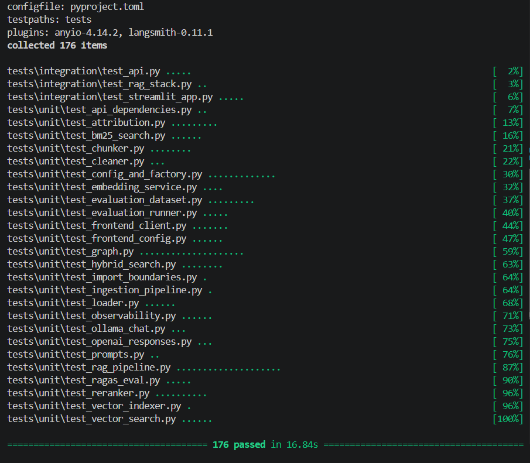

# OpsRAG

[](https://github.com/miracozmen23/opsrag/actions/workflows/tests.yml)

Hibrit bilgi getirme, cross-encoder reranking, doğrulanmış kaynak atıfları,
çevrimdışı değerlendirme, isteğe bağlı gözlemlenebilirlik ve profesyonel bir web
arayüzü sunan, üretim odaklı ve kompakt bir teknik bilgi asistanı.

> **Durum:** 17. aşama · Python 3.11+ · 176 otomatik test · Docker ile çalışan yerel sistem

## OpsRAG neden var?

Teknik ekiplerin bir olay veya arıza için ihtiyaç duyduğu cevap çoğu zaman bir
runbook, dağıtım kılavuzu ya da sorun giderme notunun içinde bulunur. Asıl zorluk,
doğru bölümü hızlıca bulmaktır. OpsRAG, küçük ve özel bir doküman koleksiyonunu
aşağıdaki özelliklere sahip aranabilir bir asistana dönüştürür:

- teknik soruları cevaplamadan önce ilgili kanıtları getirir;
- cevapta kullanılan kaynak kayıtlarını kullanıcıya gösterir;
- eksik, hatalı biçimlendirilmiş veya uydurulmuş atıfları reddeder;
- bilgi tabanı sorularını açıkça genel olan mesajlardan ayırır; ve
- yalnızca bir demo sunmak yerine getirim ve cevap kalitesini ölçer.

Proje bilinçli olarak kompakt tutulmuştur. Amacı; gereksiz dağıtık sistemler
eklemeden ve önemli kararları bir notebook içinde gizlemeden, veri alımından
değerlendirme ve teslimata kadar gerçek RAG mühendisliği pratiklerini
göstermektir.

## Ürün görünümü

### Açılış ekranı



*Örnek olay soruları ve cevap üretim sürecinin kısa özetiyle duyarlı ürün açılış
ekranı.*

### Kaynaklı cevap



*Gerçek bir Docker Compose sorun giderme sorusu hibrit getirimden geçirilir; iki
atıf, beş bağlam ve getirim metadatasıyla birlikte döndürülür.*

### Kaynak kanıtları



*Genişletilmiş kanıt kartları, atıf yapılan her kaynak için doküman, bölüm,
chunk ve ilgililik ayrıntılarını gösterir.*

## Temel özellikler

- Deterministik temizleme ile Markdown, TXT ve metin tabanlı PDF veri alımı
- Bölüm bilgisini koruyan, sabit kimlikli ve örtüşmeli 600 token'lık chunk'lar
- Qdrant üzerinde saklanan Sentence Transformers embedding'leri
- Komutlar, hata kodları ve birebir teknik terimler için BM25 sözcüksel getirim
- Dense ve sparse sıralamalar üzerinde Reciprocal Rank Fusion
- Nihai bağlam oluşturulmadan önce cross-encoder reranking
- `[S1]` gibi istek kapsamlı kaynak kimlikleri içeren dayanaklı cevaplar
- Atıf doğrulaması ve API tarafından sahiplenilen kaynak metadatası
- Bilgi tabanı ve genel mesaj yollarına sahip sınırlı LangGraph akışı
- OpenAI Responses API ve ücretsiz yerel Ollama üretim adaptörleri
- FastAPI backend ve duyarlı Streamlit ürün arayüzü
- Dense, hibrit ve reranking uygulanmış yapılandırmalar için RAGAS değerlendirmesi
- Açık gizlilik uyarılarıyla isteğe bağlı, fail-open Langfuse izleri
- CPU-only, root olmayan Docker imajları ve sağlık kontrollü Docker Compose servisleri
- Çevrimdışı çalışan 176 birim ve entegrasyon testi
- `main` dalını hedefleyen her push ve pull request için GitHub Actions testleri

## Mimari



Bilgi tabanı istekleri tek ve sınırlı bir yol izler:

```text
Dense Qdrant araması + BM25
        -> RRF birleştirme
        -> cross-encoder reranking
        -> dayanaklı prompt
        -> LLM
        -> atıf doğrulaması
        -> herkese açık API cevabı
```

Açıkça genel olan mesajlar getirim katmanını kullanmaz. Belirsiz veya teknik
sorular bilgi tabanı yoluna yönlendirilir; bu, özel bir teknik asistan için daha
güvenli davranıştır.

Modül sınırları, güven skoru anlamı, iz yapısı ve veri akışı için
[mimari kılavuzuna](docs/architecture.md) bakabilirsin.

## Teknoloji yığını

| Alan | Teknoloji | Kullanım amacı |
| --- | --- | --- |
| Dil | Python 3.11+ | Uygulama, veri alımı, değerlendirme ve testler |
| API | FastAPI + Uvicorn | Doğrulanmış HTTP sınırı ve çalışma zamanı |
| Akış | LangGraph | Sınırlı soru sınıflandırma ve yönlendirme |
| Vektör veritabanı | Qdrant | Dense vektör saklama ve benzerlik araması |
| Dense getirim | Sentence Transformers | Doküman ve sorgu embedding'leri |
| Sparse getirim | rank-bm25 | Birebir terimlere dayalı sözcüksel getirim |
| Birleştirme | Reciprocal Rank Fusion | Skor ölçeğinden bağımsız hibrit getirim |
| Yeniden sıralama | CrossEncoder | Sorguya duyarlı nihai bağlam seçimi |
| LLM sağlayıcıları | Ollama / OpenAI | Yerel ücretsiz veya uzak cevap üretimi |
| Değerlendirme | RAGAS | Dayanaklılık, ilgililik, kesinlik ve kapsam |
| Gözlemlenebilirlik | Langfuse | İsteğe bağlı iç içe istek izleri |
| Frontend | Streamlit | Ürün benzeri tarayıcı arayüzü |
| Doğrulama | Pydantic Settings | Tip kontrollü yapılandırma ve API sözleşmeleri |
| Test | Pytest + HTTPX | Birim, entegrasyon, HTTP ve arayüz testleri |
| Çalıştırma | Docker Compose | Yerel Qdrant, API ve frontend sistemi |
| CI | GitHub Actions | Push ve pull request'lerde otomatik test |

## Docker ile hızlı başlangıç

### Ön gereksinimler

- Docker Desktop ve Compose
- Ücretsiz yerel profil için Ollama veya bir OpenAI API anahtarı
- Git

Projeyi klonla ve yapılandırma dosyasını oluştur:

```bash
git clone https://github.com/miracozmen23/opsrag.git
cd opsrag
cp .env.example .env
```

Windows PowerShell kullanıyorsan `cp` yerine
`Copy-Item .env.example .env` komutunu çalıştır.

Ücretsiz yerel profil için `.env` içindeki şu değerleri ayarla:

```env
LLM_PROVIDER=ollama
LLM_MODEL=qwen3.5:2b
OLLAMA_BASE_URL=http://localhost:11434
```

Yerel modeli indir ve sistemi başlat:

```bash
ollama pull qwen3.5:2b
docker compose up --build -d
```

Örnek bilgi tabanını işle ve Qdrant indeksini oluştur:

```bash
docker compose run --rm api python scripts/ingest.py
docker compose run --rm api python scripts/index.py
```

Servisleri aç:

- Streamlit: <http://localhost:8501>
- FastAPI dokümantasyonu: <http://localhost:8000/docs>
- Sağlık kontrolü: <http://localhost:8000/health>
- Qdrant paneli: <http://localhost:6333/dashboard>

Sağlık durumunu ve logları kontrol et:

```bash
docker compose ps
docker compose logs -f api frontend
```

Bind mount ile korunan proje verilerini silmeden konteynerleri durdur:

```bash
docker compose down
```

Compose portları yalnızca localhost üzerinde yayınlar. Host makinedeki Ollama'ya
`host.docker.internal` üzerinden ulaşır. Native Linux üzerinde Ollama için
ayrıca `OLLAMA_HOST=0.0.0.0:11434` ayarı gerekebilir.

Model dosyaları, işlenmiş dokümanlar ve Qdrant verileri sırasıyla `.cache`,
`data` ve `qdrant_storage` bind mount'larıyla proje sürücüsünde kalır. Büyüyen
bu dosyalar Git kapsamı dışındadır.

## Yerel geliştirme

Sanal ortamı oluştur ve etkinleştir:

```bash
python -m venv .venv
```

```powershell
# Windows PowerShell
.\.venv\Scripts\Activate.ps1
```

```bash
# macOS / Linux
source .venv/bin/activate
```

CPU-only PyTorch ve proje bağımlılıklarını kur:

```bash
python -m pip install --upgrade pip
python -m pip install --index-url https://download.pytorch.org/whl/cpu "torch>=2.2,<3.0"
python -m pip install -e ".[dev]"
cp .env.example .env
```

Yalnızca Qdrant servisini Docker ile başlat:

```bash
docker compose up -d qdrant
```

İndeksi oluştur, API'yi başlat ve ikinci bir terminalde Streamlit'i çalıştır:

```bash
python scripts/ingest.py
python scripts/index.py
python -m uvicorn app.main:app --reload
```

```bash
python -m streamlit run frontend/streamlit_app.py
```

Model kullanan ilk komut, embedding ve reranker dosyalarını `MODEL_CACHE_DIR`
altına indirir. Bu dizinin varsayılan değeri proje içindeki
`.cache/huggingface` klasörüdür.

## Ortam değişkenleri

[`.env.example`](.env.example) dosyasını `.env` adıyla kopyala. Oluşan dosyayı
ve gerçek kimlik bilgilerini hiçbir zaman Git'e ekleme.

### Uygulama ve veri hazırlama

| Değişken | Varsayılan | Amaç |
| --- | --- | --- |
| `APP_ENV` | `development` | Çalışma ortamı etiketi |
| `LOG_LEVEL` | `INFO` | Uygulama log seviyesi |
| `CHUNK_SIZE_TOKENS` | `600` | Maksimum deterministik chunk boyutu |
| `CHUNK_OVERLAP_TOKENS` | `75` | Komşu chunk'lar arasındaki token örtüşmesi |
| `TOKENIZER_STRATEGY` | `regex_v1` | Sabit tokenizer stratejisi |
| `PROCESSED_CHUNKS_PATH` | `data/processed/chunks.jsonl` | Oluşturulan chunk çıktısı |
| `MODEL_CACHE_DIR` | `.cache/huggingface` | Yerel model önbelleği |

### Bilgi getirme

| Değişken | Varsayılan | Amaç |
| --- | --- | --- |
| `EMBEDDING_MODEL` | `BAAI/bge-small-en-v1.5` | Dense embedding modeli |
| `EMBEDDING_DEVICE` | `cpu` | Embedding çalışma aygıtı |
| `EMBEDDING_BATCH_SIZE` | `32` | Embedding batch boyutu |
| `RERANKER_MODEL` | `cross-encoder/ms-marco-MiniLM-L6-v2` | Cross-encoder modeli |
| `RERANKER_DEVICE` | `cpu` | Reranker çalışma aygıtı |
| `RERANKER_BATCH_SIZE` | `16` | Reranker batch boyutu |
| `QDRANT_URL` | `http://localhost:6333` | Qdrant adresi |
| `QDRANT_API_KEY` | boş | İsteğe bağlı Qdrant kimlik bilgisi |
| `QDRANT_COLLECTION` | `opsrag_documents` | Vektör koleksiyonu |
| `QDRANT_TIMEOUT_SECONDS` | `10` | Qdrant istek zaman aşımı |
| `QDRANT_BATCH_SIZE` | `64` | İndeksleme upsert batch boyutu |
| `TOP_K_DENSE` | `10` | Dense aday sayısı |
| `TOP_K_SPARSE` | `10` | BM25 aday sayısı |
| `TOP_K_HYBRID` | `10` | Reranker aday havuzu |
| `TOP_K_RERANK` | `5` | Nihai prompt bağlamı sayısı |
| `RRF_K` | `60` | Reciprocal Rank Fusion sabiti |

### Cevap üretimi ve değerlendirme

| Değişken | Varsayılan | Amaç |
| --- | --- | --- |
| `LLM_PROVIDER` | `openai` | `openai` veya `ollama` |
| `LLM_MODEL` | boş | Sağlayıcı model adı |
| `LLM_API_KEY` | boş | Yalnızca OpenAI için gerekli |
| `LLM_TIMEOUT_SECONDS` | `30` | Cevap isteği zaman aşımı |
| `LLM_MAX_OUTPUT_TOKENS` | `800` | Cevap çıktı sınırı |
| `OLLAMA_BASE_URL` | `http://localhost:11434` | Yerel Ollama adresi |
| `RAGAS_JUDGE_PROVIDER` | boş | İsteğe bağlı `openai` veya `ollama` hakem |
| `RAGAS_JUDGE_MODEL` | boş | Hakem model adı |
| `RAGAS_CACHE_DIR` | `.cache/ragas` | Değerlendirme modeli önbelleği |
| `RAGAS_TIMEOUT_SECONDS` | `60` | Metrik başına zaman aşımı |
| `RAGAS_MAX_RETRIES` | `3` | Metrik yeniden deneme sayısı |
| `RAGAS_MAX_OUTPUT_TOKENS` | `512` | Hakem çıktı sınırı |

### Gözlemlenebilirlik ve frontend

| Değişken | Varsayılan | Amaç |
| --- | --- | --- |
| `LANGFUSE_ENABLED` | `false` | Açık izleme onayı |
| `LANGFUSE_PUBLIC_KEY` | boş | Langfuse proje anahtarı |
| `LANGFUSE_SECRET_KEY` | boş | Langfuse gizli anahtarı |
| `LANGFUSE_BASE_URL` | `https://cloud.langfuse.com` | Onaylanmış iz hedefi |
| `LANGFUSE_SAMPLE_RATE` | `1.0` | İzlenen istek oranı |
| `OPSRAG_API_BASE_URL` | `http://localhost:8000` | Streamlit backend adresi |
| `OPSRAG_API_TIMEOUT_SECONDS` | `300` | Arayüz istek zaman aşımı |

Göreli veri ve önbellek yolları terminalin bulunduğu dizine göre değil, proje
köküne göre çözülür.

## Doküman işleme ve indeksleme

Örnek doküman koleksiyonu `data/raw` altında bulunur. Bu klasöre Markdown, TXT
veya metin tabanlı PDF dosyaları ekledikten sonra şu komutları çalıştır:

```bash
python scripts/ingest.py
python scripts/index.py
```

Veri alım süreci desteklenen dokümanları yükler ve temizler; başlık, bölüm ve
sayfa metadatasını korur; deterministik chunk'lar oluşturur ve sonucu
`data/processed/chunks.jsonl` dosyasına yazar. İndeksleme aşaması bu chunk'ları
embedding'e dönüştürür ve yalnızca indekslenen doküman kimliklerine ait noktaları
yeniler.

Koleksiyon hiçbir zaman kendiliğinden yeniden oluşturulmaz. Uyumsuz embedding
boyutu veya bilinçli bir sıfırlama gerektiğinde yalnızca şu komutu kullan:

```bash
python scripts/index.py --recreate
```

Kullanışlı getirim kontrolleri:

```bash
python scripts/search.py "PostgreSQL connection refused"
python scripts/sparse_search.py "pg_hba.conf authentication"
python scripts/hybrid_search.py "HTTP 503 Qdrant"
python scripts/rerank_search.py "When should an API return 4xx instead of 5xx?"
```

## Uygulamanın kullanımı

### Streamlit

<http://localhost:8501> adresini aç, örneklerden birini seç veya kendi sorunu
gir ve **Generate grounded answer** düğmesine bas. Arayüz şunları gösterir:

- doğrulanmış cevap;
- getirim güven skoru;
- seçilen yönlendirme ve getirim yöntemi;
- getirilen bağlam sayısı; ve
- ilgililik göstergeleriyle genişletilebilir kaynak kanıtları.

API durduğunda, zaman aşımına uğradığında veya cevap sözleşmesini ihlal ettiğinde
Streamlit uygulama traceback'i yerine güvenli bir hata mesajı gösterir.

### API

Sağlık kontrolü:

```bash
curl http://localhost:8000/health
```

Bilgi tabanı sorusu:

```bash
curl -X POST http://localhost:8000/api/v1/ask \
  -H "Content-Type: application/json" \
  -d '{"question":"Docker Compose içinde PostgreSQL neden connection refused hatası döndürüyor?"}'
```

Örnek cevap:

```json
{
  "answer": "Uygulama konteynerinden PostgreSQL Compose servis adını ve konteyner portunu kullanın [S1].",
  "sources": [
    {
      "source_id": "S1",
      "document": "postgresql_troubleshooting.md",
      "title": "PostgreSQL Troubleshooting",
      "section": "Connection refused",
      "page_number": null,
      "score": 0.9491,
      "chunk_id": "chunk_...",
      "chunk_ids": ["chunk_..."]
    }
  ],
  "retrieval_confidence": 0.9491,
  "metadata": {
    "retrieved_chunks": 5,
    "cited_sources": 1,
    "retrieval_method": "hybrid_reranked",
    "route": "knowledge"
  }
}
```

Genel mesajlar `route="general"`, `retrieval_method="not_used"`, boş kaynak
listesi ve sıfır getirim güven skoru döndürür.

## Kaynak dayanağı ve güven skoru

Cevap üretiminden önce getirilen chunk'lar özgün kaynak, başlık, bölüm ve sayfa
bilgilerine göre gruplanır. Her gruba `S1` gibi istek kapsamlı bir kimlik atanır.
Prompt yalnızca bu kimlikleri ve getirim katmanına ait metadatayı içerir.

Cevap üretiminden sonra OpsRAG:

1. bağlam kullanıldığı halde atıf içermeyen cevapları reddeder;
2. hatalı biçimlendirilmiş veya bilinmeyen kaynak kimliklerini reddeder;
3. tekrarlanan atıfları kaldırır; ve
4. yalnızca cevapta atıf yapılan kaynak kayıtlarını döndürür.

Model, API cevabında görünecek bir doküman adını uyduramaz. Herkese açık kaynak
metadatası her zaman getirilen chunk payload'ından gelir.

Reranking uygulanmış sonuçlarda herkese açık ilgililik skoru, cross-encoder
logit'inin sigmoid değeridir. `retrieval_confidence`, cevapta kullanılan
kaynaklar arasındaki en yüksek ilgililik skorudur. Bu değer kalibre edilmiş bir
olasılık veya LLM öz değerlendirmesi değil, bir getirim sezgisidir.

## Değerlendirme

Sürüm kontrolü altındaki
[`evaluation/questions.jsonl`](evaluation/questions.jsonl) benchmark'ı,
elle incelenebilir 36 senaryo içerir:

- beş örnek dokümana dayanan 30 cevaplanabilir senaryo;
- 6 yetersiz bağlam senaryosu;
- semantic, exact-keyword, error-code, multi-sentence, ambiguous ve
  insufficient-context kategorilerinin her birinde 6 senaryo.

Bir model çağırmadan benchmark yapısını doğrula:

```bash
python scripts/validate_evaluation.py
```

İlk skorlu çalıştırmadan önce isteğe bağlı RAGAS değerlendirme paketini kur:

```bash
python -m pip install -e ".[evaluation]"
```

Dense, hibrit ve hibrit + reranking deneylerini çalıştır:

```bash
python scripts/evaluate.py
```

Runner; üretilen cevapları, getirilen bağlamları, atıfları, gecikmeyi, beklenen
kaynak eşleşmesini, cevaplanabilirliği ve RAGAS faithfulness, answer relevance,
context precision ve context recall metriklerini kaydeder. Başarısız veya
tanımsız metrikler görünür kalır ve ortalamalara dahil edilmez; sessizce sıfıra
dönüştürülmez.

OpenAI kullanan çalışmalar `--confirm-paid-run` onayı gerektirir. Depodaki temel
sonuç hem cevap üretimi hem de değerlendirme için Ollama kullanmıştır ve ücretli
API çağrısı yapmamıştır.

### Doğrulanmış yerel temel sonuçlar

Sonuçlar 27 Ağustos 2026 tarihinde; 108 çalıştırma (36 senaryo × 3 getirim
yapılandırması), Ollama `qwen3.5:2b`, RAGAS 0.4.3 ve
`BAAI/bge-small-en-v1.5` embedding modeliyle üretilmiştir:

| Yapılandırma | Uygulama hatası | Beklenen kaynak | Cevaplanabilirlik | Answer relevance | Context precision | Context recall | Ortalama gecikme |
| --- | ---: | ---: | ---: | ---: | ---: | ---: | ---: |
| Dense | 3/36 | %93,33 | %88,89 | 0,7424 | 0,8215 | 0,8177 | 6,56 sn |
| Hibrit | 3/36 | %90,00 | %88,89 | 0,7285 | 0,7841 | 0,7903 | 6,32 sn |
| Hibrit + reranking | 3/36 | %86,67 | **%91,67** | **0,7452** | 0,7747 | 0,7833 | 10,58 sn |

Bu sonuçlar şeffaf bir yerel temel ölçümdür; reranking'in her metrikte üstün
olduğu iddia edilmez. Küçük hakem model eksik faithfulness çıktıları üretmiştir:
faithfulness metriği dense için yalnızca 11, hibrit için 13 ve reranking
uygulanmış yapılandırma için 11 senaryoda skorlanabilmiştir. Kapsama hataları
[`evaluation/results.json`](evaluation/results.json) içinde korunur.

Şemalar, metrik başına skorlanan senaryo sayıları, inceleme adımları ve sonuç
kaynağı için [değerlendirme kılavuzuna](evaluation/README.md) bakabilirsin.

## Testler ve CI

Çevrimdışı test paketinin tamamını çalıştır:

```bash
python -m pytest
```



*Yerel test paketindeki 176 birim ve entegrasyon testinin tamamı başarılıdır.*

176 test şunları kapsar:

- temizleme, yükleme, deterministik chunk oluşturma ve JSONL çıktısı;
- Qdrant saklama, indeksleme ve dense getirim;
- BM25, RRF, deduplication ve reranking;
- prompt biçimlendirme, kaynak gruplama ve atıf doğrulaması;
- yönlendirici ve RAG pipeline davranışı;
- OpenAI, Ollama, yapılandırma ve gözlemlenebilirlik sınırları;
- FastAPI sözleşmeleri ve gerçek HTTP istemci/sunucu sınırı;
- Streamlit etkileşimleri; ve
- bellek içi Qdrant'tan FastAPI'ye uzanan uçtan uca getirim yolu.

En derin entegrasyon testinde embedding, reranking ve cevap üretimi için
deterministik test uygulamaları kullanılır. Saklama, indeksleme, dense arama,
BM25, RRF, orkestrasyon, dayanak oluşturma, LangGraph ve FastAPI serileştirmesi
gerçek bileşenlerle çalışır. Hiçbir test API anahtarı, internet bağlantısı,
model indirme veya ücretli istek gerektirmez.

Uyarılar test paketini başarısız yapar. GitHub Actions, aynı komutu Python 3.11
ve CPU-only PyTorch ile `main` dalını hedefleyen her push ve pull request için
çalıştırır.

Güncel ve geçmiş çalıştırmalara
[GitHub Actions workflow sayfasından](https://github.com/miracozmen23/opsrag/actions/workflows/tests.yml)
ulaşabilirsin.

## İsteğe bağlı Langfuse gözlemlenebilirliği

İzleme varsayılan olarak kapalıdır. Yalnızca yapılandırılan Langfuse host'unun
soruları ve getirilen bilgi tabanı parçalarını almasına izin verildiğinde
etkinleştir:

```env
LANGFUSE_ENABLED=true
LANGFUSE_PUBLIC_KEY=<public key>
LANGFUSE_SECRET_KEY=<secret key>
LANGFUSE_BASE_URL=https://cloud.langfuse.com
LANGFUSE_SAMPLE_RATE=1.0
```

Bir bilgi tabanı isteği şu iz yapısını üretir:

```text
opsrag.query
|-- query.classify
`-- rag.pipeline
    |-- rag.retrieve
    |-- rag.generate
    `-- rag.attribution
```

Eksik kimlik bilgileri, ulaşılamayan SDK, başlatma hataları veya exporter
hataları güvenli biçimde no-op davranışına geçer ve cevap isteğini bozmaz.

Langfuse ekran görüntüsü varsayılan README'ye bilinçli olarak eklenmemiştir;
çünkü izleme isteğe bağlıdır ve sentetik bir iz gerçek üretim kaydı gibi
sunulmamıştır.

## Depo yapısı

```text
opsrag/
|-- .github/workflows/tests.yml   # Push ve pull request CI
|-- app/
|   |-- api/                      # FastAPI route, şema ve bağımlılıkları
|   |-- core/                     # Ayarlar, factory'ler ve loglama
|   |-- embeddings/               # Sentence Transformer adaptörü
|   |-- evaluation/               # Veri seti, runner, RAGAS ve sonuçlar
|   |-- ingestion/                # Yükleme, temizleme, parçalama, indeksleme
|   |-- llm/                      # Sağlayıcıdan bağımsız LLM adaptörleri
|   |-- observability/            # No-op ve Langfuse izleme
|   |-- rag/                      # Graph, prompt, atıf ve pipeline
|   `-- retrieval/                # Dense, BM25, RRF ve reranking
|-- data/raw/                     # Örnek teknik bilgi tabanı
|-- docs/                         # Mimari ve README görselleri
|-- evaluation/                   # Benchmark, sonuçlar ve değerlendirme kılavuzu
|-- frontend/                     # Streamlit arayüzü, tema ve API istemcisi
|-- scripts/                      # Veri alımı, indeksleme, arama ve değerlendirme CLI'ları
|-- tests/unit/                   # Odaklı deterministik testler
|-- tests/integration/            # API, HTTP, Streamlit ve tam RAG yolu
|-- .env.example                  # Güvenli yapılandırma şablonu
|-- docker-compose.yml            # Qdrant, API ve frontend topolojisi
|-- Dockerfile                    # Ortak CPU-only uygulama imajı
|-- pyproject.toml                # Paket ve test yapılandırması
`-- README.md
```

Üretilen chunk'lar, model önbellekleri, yerel gizli bilgiler ve Qdrant verileri
Git kapsamı dışındadır.

## Mühendislik kararları

| Karar | Gerekçe | Karşılığı |
| --- | --- | --- |
| Tutucu, kural tabanlı yönlendirici | Teknik sorular varsayılan olarak kaynaklı getirim kullanır | Genel dil kapsamı bilinçli olarak sınırlıdır |
| Ayrı dense ve BM25 getirim | Anlamsal ve birebir teknik eşleşmeler farklı sinyaller gerektirir | İki indeksin uyumlu tutulması gerekir |
| Ham skor karışımı yerine RRF | Cosine ve BM25 skorları doğrudan karşılaştırılamaz | Kalibre birleşim yerine sıralama bilgisi kullanılır |
| Birleştirmeden sonra cross-encoder | Maliyetli skor yalnızca küçük aday havuzuna uygulanır | Bilgi tabanı isteklerine gecikme ekler |
| Getirim katmanına ait atıflar | Modelin herkese açık kaynak metadatası uydurmasını önler | Geçersiz model çıktısı sessizce düzeltilmez, reddedilir |
| Lazy bilgi tabanı pipeline'ı | Genel mesajlar model yüklemez veya Qdrant'a bağlanmaz | İlk teknik istek kurulum gecikmesini taşır |
| Proje içi önbellek ve bind mount | Büyük dosyalar proje sürücüsünde kalır | Yerel disk yönetimi operatör sorumluluğundadır |
| İsteğe bağlı fail-open izleme | Gözlemlenebilirlik kullanıcı isteğini bozamaz | Export hataları için log incelemesi gerekebilir |
| Çevrimdışı deterministik testler | CI ücretsiz, tekrarlanabilir ve secretsızdır | Model kalitesi ayrı benchmark ile ölçülür |
| Dürüst metrik hataları | Tanımsız veya başarısız RAGAS sonucu sıfır gösterilmez | Toplam tablolar skorlanan senaryo bağlamı gerektirir |

## Sınırlamalar

- Dahili koleksiyon beş küçük operasyon dokümanı içerir; büyük ölçekli bir bilgi
  platformu değildir.
- Yönlendirici bilinçli olarak kural tabanlıdır ve sınırlı sayıdaki açık genel
  mesajı tanır.
- BM25 indeksi, işlenmiş JSONL çıktısından bellekte yeniden oluşturulur.
- API istekleri senkrondur ve cevaplar stream edilmez.
- PDF veri alımı metin tabanlı dosyaları destekler; taranmış PDF'ler mevcut
  kapsamın dışında OCR gerektirir.
- Kimlik doğrulama, yetkilendirme, tenant ayrımı, rate limiting veya cloud
  deployment yapılandırması bulunmaz.
- Qdrant tek bir yerel servis olarak çalışır; high availability ve dağıtık
  operasyonlar kapsam dışıdır.
- Ücretsiz `qwen3.5:2b` değerlendirme modeli eksik faithfulness kararları
  üretmiştir. Bu nedenle temel sonuç karşılaştırma için yararlı olsa da altın
  standart kalite iddiası değildir.
- `retrieval_confidence` kalibre edilmiş bir olasılık değil, ilgililik
  sezgisidir.

## Gelecek geliştirmeler

- Doküman koleksiyonunu ve insan incelemesinden geçmiş değerlendirme setini büyütmek
- Daha güçlü bir hakemle değerlendirmeyi tekrarlamak ve güven aralıklarını karşılaştırmak
- Büyük koleksiyonlar için metadata filtreleme ve kalıcı sparse indeks eklemek
- Token streaming ve asenkron model çağrıları eklemek
- Servisi localhost dışına açmadan önce kimlik doğrulama, rate limiting ve
  tenant bazlı koleksiyonlar eklemek
- Taranmış dokümanlar ve daha zengin formatlar için OCR eklemek
- Getirim güven skorunu etiketli ilgililik kararlarıyla kalibre etmek
- Yalnızca gerçek bir hedef ortam seçildiğinde deployment profilleri eklemek

## Ek dokümantasyon

- [Mimari](docs/architecture.md)
- [Değerlendirme yöntemi ve şemaları](evaluation/README.md)
- [Adım adım proje tanımı](OPSRAG_PROJECT_PLAN.md)
